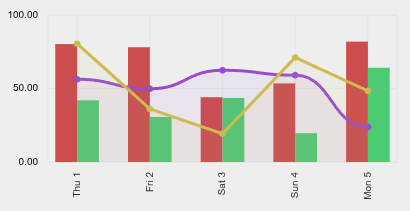
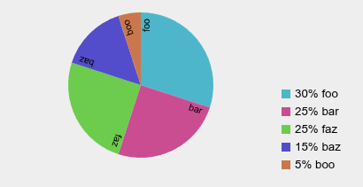

# swift_charts

Simple charts using package:web and canvas.

Used in swift.shop admin panels for analytics.


## chart types

### Time Charts

Charts with time on X axis.

Can have multiple series displayed either as bar or line charts.

Supports smoothing and configurable axis.

Example:
```dart
var random = Random();

Map<int, num> randomTimeData() => {
  DateTime.parse('2026-10-01').millisecondsSinceEpoch: random.nextDouble() * 75.0 + 10.0,
  DateTime.parse('2026-10-02').millisecondsSinceEpoch: random.nextDouble() * 75.0 + 10.0,
  DateTime.parse('2026-10-03').millisecondsSinceEpoch: random.nextDouble() * 75.0 + 10.0,
  DateTime.parse('2026-10-04').millisecondsSinceEpoch: random.nextDouble() * 75.0 + 10.0,
  DateTime.parse('2026-10-05').millisecondsSinceEpoch: random.nextDouble() * 75.0 + 10.0,
};

SwiftTimeChart(
  container: document.getElementById('timechart0') as HTMLDivElement, 
  series: [
    BarSeries(
      data: randomTimeData()
    ),
    BarSeries(
      data: randomTimeData()
    ),
    LineSeries(
      data: randomTimeData(),
      smoothing: 1.0,
      lineWidth: 3
    ),
    LineSeries(
      data: randomTimeData(),
      lineWidth: 3
    ),
  ]
);
```




### Pie Charts

Simple pie charts.

Example:
```dart
SwiftPieChart(
    container: document.getElementById('piechart') as HTMLDivElement, 
    legend: true, 
    data: [
        PieChartItem('foo', 30),
        PieChartItem('bar', 25),
        PieChartItem('faz', 25),
        PieChartItem('baz', 15),
        PieChartItem('boo', 5),
    ]
);
```




## usage details

See example charts:

https://coffee-software.github.io/swift_charts/

Please see example folder. 

Serve example: 

```
webdev serve example
```

Build example:
```
dart compile js -o docs/example.dart.js example/example.dart
cp example/index.html docs/
```